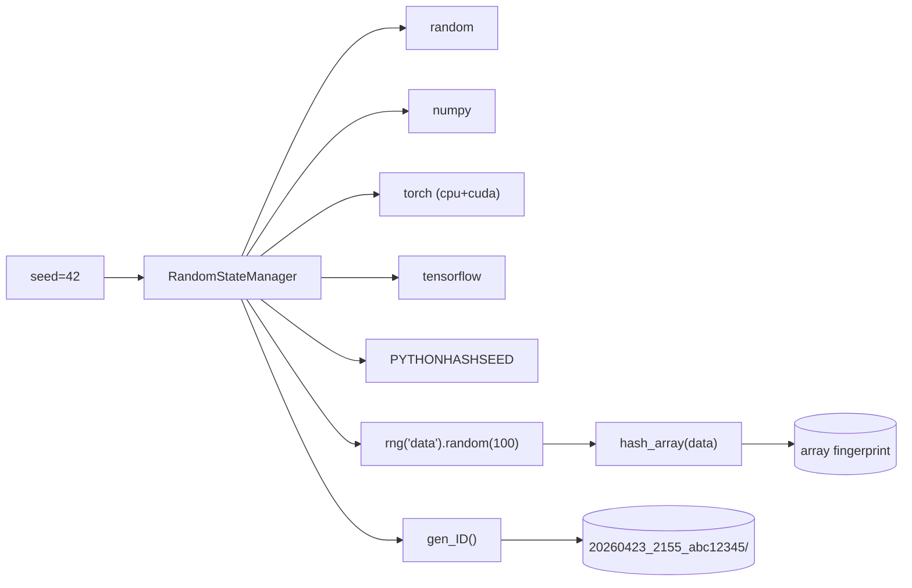

# scitex-repro

<p align="center">
  <a href="https://scitex.ai">
    
  </a>
</p>

<p align="center"><b>Reproducibility utilities — RNG seeding, ID generation, timestamps, array hashing.</b></p>

<p align="center">
  <a href="https://scitex-repro.readthedocs.io/">Full Documentation</a> · <code>uv pip install scitex-repro[all]</code>
</p>

<!-- scitex-badges:start -->
<p align="center">
  <a href="https://pypi.org/project/scitex-repro/"></a>
  <a href="https://pypi.org/project/scitex-repro/"></a>
  <a href="https://github.com/ywatanabe1989/scitex-repro/actions/workflows/test.yml"></a>
  <a href="https://github.com/ywatanabe1989/scitex-repro/actions/workflows/install-test.yml"></a>
  <a href="https://codecov.io/gh/ywatanabe1989/scitex-repro"></a>
  <a href="https://scitex-repro.readthedocs.io/en/latest/"></a>
  <a href="https://www.gnu.org/licenses/agpl-3.0"></a>
</p>
<!-- scitex-badges:end -->

---

## Problem and Solution

| # | Problem | Solution |
|---|---------|----------|
| 1 | **"Seed everything" requires 5+ lines of boilerplate** — `random.seed()` + `np.random.seed()` + `torch.manual_seed()` + `torch.cuda.manual_seed_all()` + `tf.random.set_seed()` + `os.environ[PYTHONHASHSEED]` | **`RandomStateManager(seed=42)`** — one call seeds every framework detected in the env; `.reset()` rewinds mid-experiment |
| 2 | **Experiment run directories collide** — two parallel runs overwrite each other | **`gen_ID()` + `hash_array()`** — unique directory names like `20260423_2155_abc12345`; deterministic array fingerprints for integrity checks |

## Installation

```bash
pip install scitex-repro
```

## Architecture

```
src/scitex_repro/
├── __init__.py              # public re-exports
├── _RandomStateManager.py   # cross-framework RNG seeding (random / numpy / torch / tf)
├── _gen_ID.py               # 20260423_2155_<hash> directory IDs
├── _gen_timestamp.py        # filesystem-safe timestamps
├── _hash_array.py           # deterministic NumPy / pandas fingerprints
└── _config.py               # env-var + config defaults
```

## 1 Interfaces

<details open>
<summary><strong>Python API</strong></summary>

<br>

```python
from scitex_repro import RandomStateManager, gen_ID, hash_array

# Cross-framework RNG seeding
rng = RandomStateManager(seed=42)
data = rng("data").random(100)
rng.verify(data, "my_data")
rng.reset()

# Deterministic IDs and array fingerprints
exp_id = gen_ID()                         # "20260423_2155_abc12345"
fingerprint = hash_array(data)
```

</details>

## Demo



## Quick Start

```python
from scitex_repro import RandomStateManager, gen_ID, hash_array

rng = RandomStateManager(seed=42)
data = rng("data").random(100)
print(gen_ID(), hash_array(data))
```

## Part of SciTeX

`scitex-repro` is part of [**SciTeX**](https://scitex.ai). Install via
the umbrella with `pip install scitex[repro]` to use as
`scitex.repro` (Python) or `scitex repro ...` (CLI).

>Four Freedoms for Research
>
>0. The freedom to **run** your research anywhere — your machine, your terms.
>1. The freedom to **study** how every step works — from raw data to final manuscript.
>2. The freedom to **redistribute** your workflows, not just your papers.
>3. The freedom to **modify** any module and share improvements with the community.
>
>AGPL-3.0 — because we believe research infrastructure deserves the same freedoms as the software it runs on.

## License

AGPL-3.0-only (see [LICENSE](./LICENSE)).

---

<p align="center">
  <a href="https://scitex.ai" target="_blank"></a>
</p>
